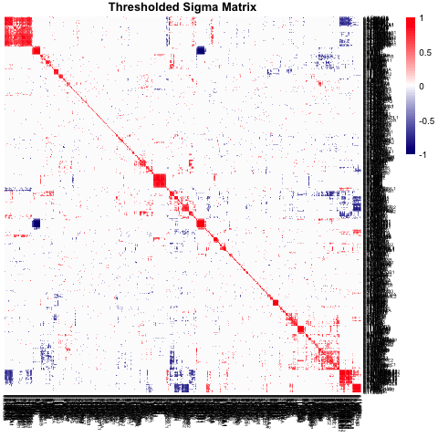
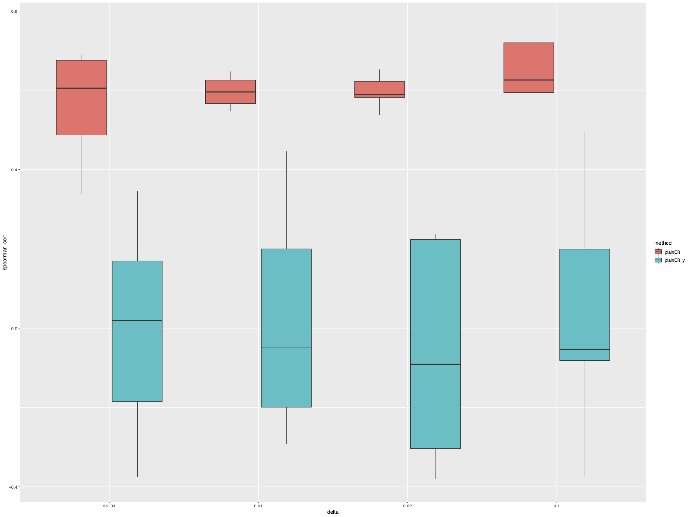

### Housekeeping

```{r setup, echo = F, warning = F, message = F}
knitr::opts_chunk$set(echo = TRUE)
```

Before beginning, please ensure that the following packages are installed and libraries are loaded. 
The Essential Regression package is available for downloading using the following code:
`devtools::install_github("Hanxi-002/EssReg", auth_token = "TOKEN_HERE", build_vignettes = TRUE)`
The other packages can be installed from CRAN.

```{r setup-pkgs, warning = F, message = F}
library(matrixcalc)
library(readr)
library(ROCR)
library(e1071)
library(dplyr)
library(doParallel)
library(foreach)
library(scales)
library(clusterGeneration)
library(doRNG)
library(matlib)
library(BAS)
library(gmp)
library(EssReg)
library(priorER) ## only needed for example dataset
```

We also recommend running some of these function in parallel. We prepare the environment for this using the following code:
```{r setup-par, warning = F, message = F}
cores <- detectCores()
registerDoParallel(cores)
```

-----

### Data Set-Up

We first must load in our data. Essential Regression accepts a data matrix ($\mathbf{X}$) of dimensions $n \times p$, where $n$ is the number of samples/patients/instances and $p$ is the number of features/variables, and a response vector ($\mathbf{Y}$) of dimension $n$ that can be either categorical or continuous. 

This implementation of Essential Regression and its related functions all assume properly formatted and processed data. This data should be raw (non-standardized, non-normalized) as Essential Regression performs the standardization steps itself. However, this data should be pre-processed and cleaned. Missing values should be dealt with in an appropriate fashion (i.e. imputation, removal, etc.). Additionally, the structure and sparsity of $\mathbf{X}$ should be explored to ensure that the column-wise standard deviations do not equal zero and that there are no majority zero columns or rows.

If using the pipeline, the data should be provided as `.csv` files (alternative file formats coming soon). Column names are encouraged, and row names are optional. However, it is important that the column and row names are, in fact, column and row names rather than an extra column or row in the matrices themselves. If your data has row names as column #1 or column names as row #1, please remove them. 

As an example, we use a dataset of expression measurements of 892 genes from 24 patients. $\mathbf{Y}$ is the Modified Rodnan Skin Score. This dataset is included in the `priorER` package:
```{r data-load}
data(x_data); data(y_data)
```

-----

### Running Essential Regression {.tabset .tabset-fade .tabset-pills}

The function, `plainER()`, requires non-standardized data because of an internal cross-validation regime. Thus, there is little pre-processing to perform before we can dive into using the package!

#### Function Parameters

In this section, we briefly cover the many parameters and flags passed to `plainER()` for run specification.

- `x`: $\mathbf{X}$, a data matrix [$n \times p$].
- `y`: $\mathbf{Y}$, a vector [$n$].
- `sigma`: $\hat{\Sigma}$, the sample correlation matrix calculated from $\mathbf{X}$ [$p \times p$].
- `thresh_fdr`: The false discovery rate threshold on $\hat{\Sigma}$. We use this value as the upper limit for the $p$-values of the entries of `sigma` - if a given $p$-value is less than `thresh_fdr`, the entry is set to 0 in `sigma`.
- `delta`: $\delta$, a numerical constant used in the LOVE algorithm (CITE) for identifying latent cluster membership. We can specify either a single value or a range over which to search for the optimal value.
- `lambda`: $\lambda$, a numerical constant used in the LOVE algorithm (CITE) for identifying latent cluster membership.
- `rep_cv`: An integer indicating the number of replicates to perform when cross-validating to find $\delta$.
- `out_path`: A string path to the directory in which to save output.

Additional information on the exact algorithm and methodology behind LOVE and Essential Regression is outside the scope of this tutorial, but they can be found in the original manuscripts: 

-----

#### Running `plainER()`

Now that we understand the function specification, we can run Essential Regression.
```{r init-er, message = F, warning = F, eval = F}
initial_run <- plainER(y = y_data,
                       x = x_data,
                       sigma = cor(x_data),
                       thresh_fdr = 0.2,
                       delta = seq(0.001, 0.1, 0.001),
                       lambda = 0.5, 
                       alpha_level = 0.05,
                       rep_cv = 50,
                       out_path = "temp/")
```

```{r init-er-cache, message = F, warning = F, echo = F}
if (file.exists("vignette/plain_er.rds")) {
  initial_run <- readRDS("vignette/plain_er.rds")
} else {
  initial_run <- plainER(y = y_data,
                         x = x_data,
                         sigma = cor(x_data),
                         thresh_fdr = 0.2,
                         delta = seq(0.001, 0.1, 0.001),
                         lambda = 0.5,
                         alpha_level = 0.05,
                         rep_cv = 50,
                         out_path = "temp/")
  saveRDS(initial_run, file = "vignette/plain_er.rds")
}
```

`plainER()` has a significant amount of output, which we cover below. 

- `K`: The number of clusters identified by LOVE.
- `A`: $\hat{A}$, the estimated allocation matrix that indicates the latent cluster membership for all features [$p \times K$].
- `C`: $\hat{C}$, the estimated covariance matrix of $\mathbf{Z}$ [$K \times K$].
- `I_clust`: $\hat{I}$ as a list where each entry, $i$, is a vector containing the features that are found in latent cluster $i$.
- `I`: $\hat{I}$ as a vector of all features that are included in the latent clusters.
- `Gamma`: $\Gamma$, the estimated covariance of the error terms, $W$, from the factorization of $\mathbf{X}$ into $A\mathbf{Z} + W$. 
- `beta`: $\beta$, the estimated coefficients for the regression on the latent variables, $\mathbf{Y} = \beta \mathbf{Z} + \epsilon.
- `beta_conf_int`: The confidence intervals for the estimation of $\beta$ according to the signficance level, $\alpha$, specified by `alpha_level`.
- `beta_var`: The variance of the estimates of $\beta$.
- `pred`: A list containing the Essential Regression predictor ($\hat{\theta}_{ER}$), $\hat{\Theta}$, as well as the predicted values ($\mathbf{Y}$) made using the predictor. 
- `opt_lambda`: The value of $\lambda$ used.
- `opt_delta`: The value of $\delta$ used.
- `Q`: $\hat{\theta}_{ER}^\top \times \mathbf{X}^\top$ [$p \times K$]
- `thresh_sigma`: The matrix, $\hat{\Sigma}$, after thresholding according to `thresh_fdr`.

If `out_path` is supplied to the call to `plainER()`, then the function also saves heatmaps of $\hat{\Sigma}$ and the thresholded version of $\hat{\Sigma}$.

-----

#### Inspection of Results {.tabset .tabset-fade .tabset-pills}

We can peek at what $\delta$ `plainER()` decided to use after 50 replicates of cross-validation:
```{r init-delta, warning = F, message = F}
initial_run$opt_delta
```

#### Thresholded $\hat{\Sigma}$
We can also use the `makeHeatmap()` function, a wrapper for the `pheatmap()` function from `pheatmap`, to view the thresholded $\hat{\Sigma}$ matrix:
```{r init-sigma-hmap, warning = F, message = F, eval = F}
makeHeatmap(mat = initial_run$thresh_sigma, ## matrix
            title = "Thresholded Sigma Matrix",  ## plot title
            cluster = T, ## boolean for clustering
            names = T) ## boolean for displaying column/row names
```

```{r init-sigma-hmap-cache, out.width = "60%", fig.show = 'hold', fig.align = 'center', echo = F, message = F, warning = F}
if (file.exists("vignette/init_sigma_hmap.png")) {
   
} else {
  png(filename = "vignette/init_sigma_hmap.png")
  makeHeatmap(mat = initial_run$thresh_sigma, ## matrix
              title = "Thresholded Sigma Matrix",  ## plot title
              cluster = T, ## boolean for clustering
              names = T) ## boolean for displaying column/row names
  dev.off()
   
}
```

This should match with the heatmap created and saved within `plainER()`.

Note: The heatmaps will be saved to a directory labeled with either the value of $\delta$ used in Essential Regression if a single value is provided or the first value of $\delta$ in the range to search over if a sequence is provided.

#### Clusters

For more information on the clustering of the variables, we can use the `readER()` function. `readER()` takes as input the results of `plainER()` and returns a list of latent clusters, a vector fo pure variable indices, and a vector of mixed variable indices.

```{r init-read, warning = F, message = F}
initial_read <- readER(initial_run)
```

First 10 pure variables: `r indName(initial_read$pure_vars[1:10], colnames(x_data), F)`

First 10 mixed variables: `r indName(initial_read$mix_vars[1:10], colnames(x_data), F)`

-----

### Pipeline {.tabset .tabset-fade .tabset-pills}

#### Cross-Validation
We also provide a cross-validation regime based upon `K-CV()` in the original Essential Regression package. This regime is implemented in the function `essregCV()`, which accepts all of the parameters used in `plainER()` and `priorER()` in addition to a few others:

- `k`: The number of folds to use for training/validation set creation.
- `sel_corr`: A boolean flag indicating whether to evaluate models using the Spearman correlation between $\mathbf{Y}$ and $\hat{\mathbf{Y}}$ or to use MSE/AUC. 
- `y_factor`: A boolean flag indicating whether `y` is categorical (`TRUE`) or continuous (`FALSE`).
- `priors`: (For `priorER()`), a vector of the important feature/variable indices.
- `perm_option`: A string indicating the type of permutation test do perform. Can be `NULL` for no permutations, `x` to permute the columns of `x`, `y` to permute the entries of `y`, `xy` to permute `x` and `y`, or `ybs` to permute the entries of `y` before splitting into training/validation sets. 
- `change_all`: (For `priorER()`), a boolean flag indicating whether to change $\hat{\Sigma}$ minimally (`FALSE`) or to change all entries (`TRUE`).
- `rep`: The replicate number. This is only used for saving intermediate output during cross-validation.

-----

#### Pipeline Steps

The main contribution of this package is a pipeline for the estimation of the hyperparameters of Essential Regression, $\delta$ and $\lambda$. The pipeline consists of four steps, which are split into two functions: `pipeline1()` and `pipeline2()`. The algorithm is as follows:

**`pipeline1()`**

Step 1: 

- Initialize a coarse grid of potential values for $\delta$:
  + [0.001, 0.001] by 0.001
  + [0.001, 0.01] by 0.001
  + [0.01, 0.1] by 0.01
  + [0.1, 1] by 0.1
- Run `plainER()` on each of these sequences to get a list of four optimal values (one from each sequence)

Step 2:

- Run `essregCV()` for $r$ replicates
- Plot the model performance for user inspection
  + This step creates a boxplot of the average MSE/AUC/Spearman correlations by $\delta$. Separate boxes for no permutations and $y$ permutations are created if permutations of $y$ are conducted. 
  
`pipeline1()` also supports the specification of steps to run using the parameter `steps`. This parameter can be set to `1`, `2`, or `all`. For the sake of this example, we run all steps. 

**`pipeline2()`**

The second half of the Essential Regression pipeline requires the user to specify a range over which to conduct a fine search for $\delta$. Alternatively, the user can supply a single value, and the function will create its own fine grid around the provided value. 

Step 3: 

- Run `plainER()` on the provided (or generated) fine $\delta$ grid.

Step 4:

- For each value of $\lambda$ in the vector provided by the user:
  + Run `essregCV()` for $r$ replicates.
- Plot the model performance for user inspection.
  + This step creates a boxplot of the average MSE/AUC/Spearman correlations by $\lambda$. Separate boxes for no permutations and $y$ permutations are created if permutations of $y$ are conducted.
  
After running both `pipeline1()` and `pipeline2()`, a user will have boxplots that provide insight into the optimal values to use for $\delta$ and $\lambda$. 

-----

#### Running `pipelineER1()`
Both pipeline functions require `steps` and a path to a .yaml file (`yaml_path`) that contains all of the other parameter values. We organize the functions in this way to facilitate scripting. 

Below is an example .yaml file for `pipelineER1()` to show the correct formatting: 

```{r yaml1, warning = F, message = F, eval = F}
---
x_path: /path/to/x_data   # path to .csv file for data matrix
y_path: /path/to/y_data   # path to .csv file for response vector
out_path: /output/path/   # path to directory for saving results
k: 5                      # number of folds for cross-validation
priors: NULL              # list of important variables for priorER()
rep_cv: 50                # number of replicates for cross-validation for delta
sel_corr: TRUE            # perform evaluation using Spearman correlation?
nreps: 10                 # number of replicates for cross-validation in step 2
alpha_level: 0.05         # alpha level for confidence intervals
thresh_fdr: 0.2           # false discovery rate thresholding p-value cutoff
```

```{r pipeline1, warning = F, message = F, eval = F}
pipe1_run <- pipelineER1(yaml_path = "~/pipeline1.yaml", steps = "all")
```

`pipelineER1()` saves all intermediate steps/folds as `.rda` files for easier debugging and investigation of cross-validation. The main output of interest are boxpots comparing various values of $\delta$ and models according to an evaluation metric (Spearman correlation by default). From our run above, we get a $\delta$ boxplot comparing different magnitudes of $\delta$ (coarse search). We also get a series of boxplots comparing a variety of methods for the best values of $\delta$ chosen by Step 1. For our run, we compared IVS, LASSO, plainER with a subset of $\beta$, plainER with all $\beta$, and plainER with IVS.

-----

#### Running `pipelineER2()`

From the output of steps 1 and 2, we choose a value around which to center our fine $\delta$ search. For this example, we chose 0.03. We also provide a grid over which to perform a search for the optimal value of $\lambda$. Below is an example .yaml file for `pipelineER2()` to show the correct formatting: 

```{r yaml2, warning = F, message = F, eval = F}
---
x_path: /path/to/x_data    # path to .csv file for data matrix
y_path: /path/to/y_data    # path to .csv file for response vector
out_path: /output/path/    # path to directory for saving results
k: 5                       # number of folds for cross-validation
delta: 0.03                # chosen delta (or delta grid for fine search)
lambda: [0.1, 0.5, 1, 1.5] # lambda grid
y_factor: FALSE            # is y categorical?
priors: NULL               # list of important variables for prior ER
rep_cv: 50                 # number of replicates for cross-validation for delta
nreps: 10                  # number of replicates for cross-validation in step 4
sel_corr: TRUE             # evaluate with Spearman correlation?
alpha_level: 0.05          # alpha level for confidence intervals
thresh_fdr: 0.2            # false discovery rate thresholding p-value cutoff
```

```{r pipeline2, warning = F, message = F, eval = F}
pipe2_run <- pipelineER2(yaml_path = "~/pipeline2.yaml", steps = "all")
```

-----

### Pipeline Plots {.tabset .tabset-fade .tabset-pills}

#### `pipelineER1()` Plots

```{r delta-select, out.width = "50%", fig.cap = "Delta Selection Boxplot", fig.show = 'hold', fig.align = 'center', echo = F, message = F, warning = F}
 
```

```{r delta-12, out.width = "49%", fig.cap = "Delta = 9e-04 & 0.01 Boxplots", fig.show = 'hold', fig.align = 'center', echo = F, message = F, warning = F}
knitr::include_graphics(c("vignette/delta_9e-04_boxplot.png", "vignette/delta_0.01_boxplot.png")) 
```

```{r delta-34, out.width = "49%", fig.cap = "Delta = 0.02 & 0.1 Boxplots", fig.show = 'hold', fig.align = 'center', echo = F, warning = F, message = F}
knitr::include_graphics(c("vignette/delta_0.02_boxplot.png", "vignette/delta_0.1_boxplot.png")) 
```

-----

#### `pipelineER2()` Plots

```{r lambda-select, out.width = "50%", fig.cap = "Lambda Selection and Lambda = 0.5 Boxplots ", fig.show = 'hold', fig.align = 'center', echo = F, message = F, warning = F}
knitr::include_graphics(c("vignette/lambda_selection_boxplot.png", "vignette/lambda_0.5_boxplot.png")) 
```

```{r lambda-34, out.width = "49%", fig.cap = "Lambda = 1.0 & 1.5 Boxplots", fig.show = 'hold', fig.align = 'center', echo = F, warning = F, message = F}
knitr::include_graphics(c("vignette/lambda_1_boxplot.png", "vignette/lambda_1.5_boxplot.png")) 
```

-----

### Summary 

After running both `pipelineER1()` and `pipelineER2()`, we have gained enough information to make an educated estimate of the optimal values to use for $\lambda$ and $\delta$. Though this example walked through the pipeline with respect to plain Essential Regression, the pipeline is compatible with Essential Regression with Prior Information as well. Simply provide the important variables as a vector of column names or indices in the .yaml file, and the pipeline will take care of the rest!
